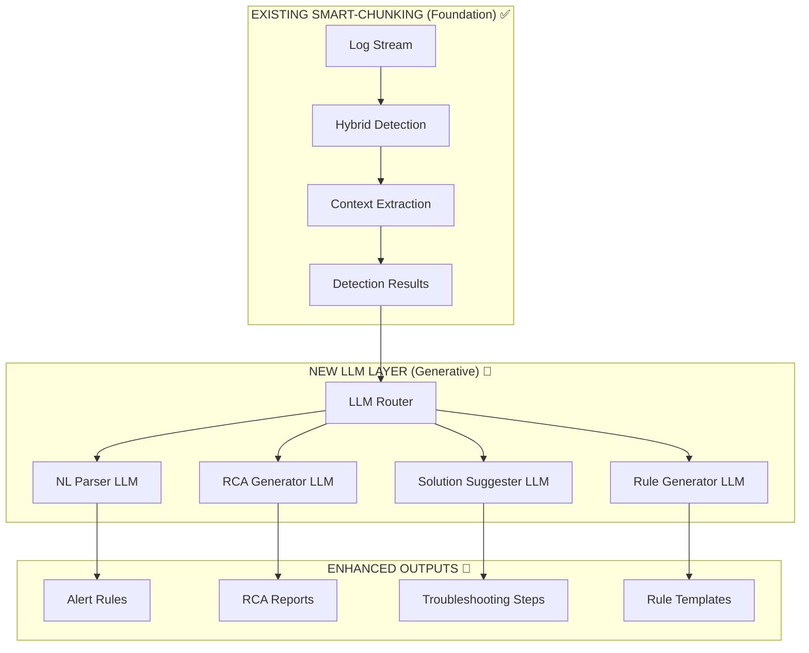

# LLM INTEGRATION PLAN: Smart-Chunking + Generative AI

## 🎯 STRATEGIC APPROACH: Your System Provides PERFECT LLM Input

### 🧠 THE INTEGRATION INSIGHT
Your smart-chunking system already produces **rich, structured data** that's ideal for LLM input:
- **Context extraction**: Before/after lines for full error context
- **Confidence scoring**: Reliability indicators for LLM decision-making
- **Pattern matching**: Structured error categorization
- **Semantic analysis**: Understanding of error meaning
- **Statistical insights**: Anomaly detection results

**This makes LLM integration much easier than starting from scratch!**

---

## 🏗️ LLM INTEGRATION ARCHITECTURE



---

## 🤖 LLM COMPONENTS TO ADD

### 1. **Natural Language Parser** (Critical - Phase 1)
**Purpose**: Convert user natural language → JSON alert rules

**Input from Smart-Chunking**:
```python
# Your existing system provides pattern knowledge
existing_patterns = {
    "ansible_errors": ["fatal:", "UNREACHABLE!", "FAILED - RETRYING"],
    "confidence_weights": {"fatal": 0.95, "failed": 0.80},
    "semantic_phrases": ["connection could not be established", "authentication failed"]
}
```

**LLM Integration**:
```python
import openai  # or local LLM

class NaturalLanguageParser:
    def __init__(self, smart_chunking_patterns):
        self.patterns = smart_chunking_patterns  # Use existing pattern knowledge
        self.llm_client = openai.OpenAI()
    
    def parse_alert_request(self, user_input: str) -> dict:
        """Convert natural language to alert rule using existing patterns."""
        
        # Create prompt with existing pattern context
        prompt = f"""
        Convert this natural language alert request to a JSON rule:
        "{user_input}"
        
        Available Ansible patterns: {self.patterns['ansible_errors']}
        Available error types: {list(self.patterns['confidence_weights'].keys())}
        
        Generate JSON rule format:
        {{
            "detector_config": {{"type": "hybrid", "confidence_threshold": 0.8}},
            "conditions": {{"error_types": [...], "frequency": {{"threshold": X, "window": "Xm"}}}},
            "notifications": {{"channels": [...], "severity": "..."}}
        }}
        """
        
        response = self.llm_client.chat.completions.create(
            model="gpt-4",
            messages=[{"role": "user", "content": prompt}]
        )
        
        return json.loads(response.choices[0].message.content)

# Usage
parser = NaturalLanguageParser(existing_patterns)
rule = parser.parse_alert_request(
    "Page me if deploy_app playbook fails on more than 3 hosts in 5 minutes"
)
```

### 2. **RCA Generator** (Important - Phase 2)
**Purpose**: Generate root cause analysis from detection results

**Input from Smart-Chunking**:
```python
# Your system already provides rich context
detection_context = {
    "error_results": [
        {
            "error_type": "hybrid_fatal",
            "confidence": 0.95,
            "context_before": ["TASK [Check SSH connectivity]", "..."],
            "context_after": ["NO MORE HOSTS LEFT", "..."],
            "matched_patterns": ["fatal:", "UNREACHABLE!"],
            "cluster_id": 1,  # From ML clustering
            "timestamp": "2025-07-18T20:45:46Z"
        }
    ],
    "correlation_data": {
        "similar_errors": 3,  # From clustering
        "affected_hosts": ["bastion.sqght.internal"],
        "playbook_context": "deploy_infrastructure"
    }
}
```

**LLM Integration**:
```python
class RCAGenerator:
    def generate_rca_report(self, detection_context: dict) -> str:
        """Generate RCA using smart-chunking context."""
        
        prompt = f"""
        Generate a Root Cause Analysis report for this Ansible failure:
        
        Error Details: {detection_context['error_results']}
        Context: {detection_context['correlation_data']}
        
        Include:
        1. Timeline of events (use timestamps and context)
        2. Root cause analysis (use pattern matching insights)
        3. Impact assessment (use cluster analysis)
        4. Recommended actions (specific to Ansible/infrastructure)
        
        Write in professional incident report format.
        """
        
        # Generate using existing context richness
        response = self.llm_client.chat.completions.create(
            model="gpt-4",
            messages=[{"role": "user", "content": prompt}]
        )
        
        return response.choices[0].message.content
```

### 3. **Solution Suggester with RAG** (Important - Phase 2)
**Purpose**: Provide troubleshooting steps using knowledge base

**Integration with Smart-Chunking**:
```python
from langchain import VectorStore, OpenAI
from langchain.chains import RetrievalQA

class SolutionSuggester:
    def __init__(self):
        # Create knowledge base from Ansible docs + historical solutions
        self.knowledge_base = self._build_ansible_kb()
        self.llm = OpenAI()
        
    def suggest_solutions(self, detection_result: dict) -> str:
        """Suggest solutions using RAG + smart-chunking insights."""
        
        # Use smart-chunking analysis for better retrieval
        query_context = f"""
        Error: {detection_result['error_type']}
        Patterns: {detection_result['matched_patterns']}
        Context: {detection_result['context_before'][-2:]}
        Confidence: {detection_result['confidence']}
        """
        
        # RAG retrieval using smart-chunking context
        qa_chain = RetrievalQA.from_chain_type(
            llm=self.llm,
            retriever=self.knowledge_base.as_retriever(),
            return_source_documents=True
        )
        
        response = qa_chain({
            "query": f"How to fix this Ansible error: {query_context}"
        })
        
        return response['result']
```

---

## 📋 IMPLEMENTATION PHASES WITH LLM

### **Phase 1: Core + NL Parser** (Weeks 3-6)
```bash
# Add to existing development plan
Week 3-4: Alert Engine (as planned)
Week 5: Add LLM Natural Language Parser
Week 6: Integrate NL parser with existing detection engine
```

**Components to Add**:
```bash
src/
├── llm/                    # NEW
│   ├── nl_parser.py           # Natural language to JSON rules
│   ├── prompt_templates.py    # Ansible-specific prompts
│   └── llm_client.py          # OpenAI/local LLM wrapper
├── alerting/               # EXISTING (Week 3-4)
│   └── rule_engine.py         # Enhanced with LLM-generated rules
```

### **Phase 2: Generative Features** (Weeks 7-10)
```bash
Week 7-8: RCA Generator + Solution Suggester
Week 9-10: Enhanced UI with generative features
```

**Components to Add**:
```bash
src/
├── llm/
│   ├── rca_generator.py       # Root cause analysis
│   ├── solution_suggester.py # RAG-based troubleshooting
│   └── knowledge_base.py      # Ansible KB management
├── rag/                    # NEW
│   ├── vector_store.py        # Document embeddings
│   └── retrieval.py           # Context-aware retrieval
```

---

## 🎯 LLM MODEL RECOMMENDATIONS

### **For Natural Language Parsing**:
- **Production**: GPT-4 API (most reliable for structured output)
- **Cost-conscious**: GPT-3.5-turbo with fine-tuning
- **On-premise**: Llama 2 7B fine-tuned on Ansible alert patterns

### **For RCA Generation**:
- **Production**: GPT-4 (best reasoning capabilities)
- **Hybrid**: Claude-3 for analysis + GPT-4 for formatting
- **On-premise**: Mistral 7B with RAG augmentation

### **For Solution Suggestions**:
- **Best**: RAG with GPT-4 + Ansible documentation vector store
- **Alternative**: Fine-tuned Code Llama on Ansible troubleshooting guides

---

## 🔗 INTEGRATION WITH EXISTING SYSTEM

### **Perfect Synergy**:
1. **Smart-chunking detects errors** → Provides structured input to LLMs
2. **LLMs generate insights** → Enhanced by smart-chunking context
3. **Combined output** → Much richer than either alone

### **Data Flow**:
```
Ansible Logs → Smart-Chunking Detection → Rich Context →
LLM Processing → Generated Insights → Enhanced Alerts
```

### **Example End-to-End**:
```python
# 1. Smart-chunking detects error
detection_result = hybrid_detector.detect(ansible_log_line)

# 2. LLM generates RCA using smart-chunking context  
rca_report = rca_generator.generate_rca_report(detection_result)

# 3. LLM suggests solutions using detection insights
solutions = solution_suggester.suggest_solutions(detection_result)

# 4. Combined output
enhanced_alert = {
    "detection": detection_result,  # From smart-chunking
    "rca": rca_report,             # From LLM
    "solutions": solutions,         # From LLM + RAG
    "confidence": detection_result.confidence  # Trust smart-chunking confidence
}
```

---

## 💰 COST CONSIDERATIONS

### **API Costs** (OpenAI GPT-4):
- **NL Parsing**: ~$0.01 per alert rule creation (one-time)
- **RCA Generation**: ~$0.05 per incident report
- **Solution Suggestions**: ~$0.02 per troubleshooting request

**For enterprise volume** (1000 incidents/month): ~$80/month in LLM costs

### **Cost Optimization**:
1. **Use smart-chunking confidence** to decide when to invoke LLM
2. **Cache common solutions** to avoid repeated LLM calls  
3. **Start with GPT-3.5**, upgrade to GPT-4 for complex cases
4. **Consider local LLMs** for sensitive environments

---

## 🚀 IMMEDIATE NEXT STEPS FOR LLM INTEGRATION

### **This Week** (Add to existing plan):
```bash
# Day 1: Research LLM options
pip install openai langchain

# Day 2: Create basic NL parser prototype
# Test: "Alert if failed > 3" → JSON rule

# Day 3: Integrate with existing detection results
# Test: Generate RCA from hybrid_detector output

# Day 4-5: Demo LLM + smart-chunking integration
```

### **Proof of Concept**:
```python
# Show how LLM enhances smart-chunking results
detection = hybrid_detector.detect(ansible_error_line)
enhanced_report = llm_rca_generator.enhance(detection)
# Result: Detection accuracy + human-readable insights
```

**The key insight**: Your smart-chunking system provides the **perfect foundation** for LLM integration - it gives LLMs structured, high-confidence input to work with, making the generative AI much more reliable and useful!
